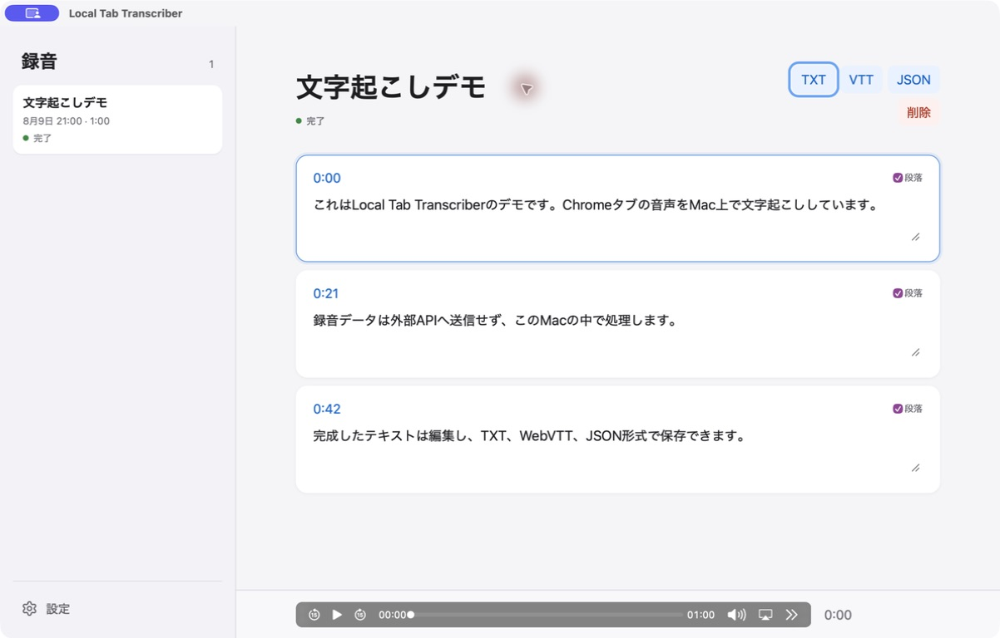

# TabTapCap

Chromeの現在のタブ音声をMac上だけで文字起こしし、句読点・文・段落を整えた日本語テキストとWebVTTを編集・保存するローカルアプリです。

## 開発状況

本プロジェクトは開発中です。現在はApple Silicon Macを対象としており、一般配布向けに署名・notarizationを行ったバイナリは提供していません。利用する場合はソースコードからアプリとChrome拡張をビルドしてください。



```text
apps/
  desktop/    React ViewerとTauri macOSアプリ
  extension/  Chromeタブ音声の取得と録音操作
crates/
  transcriber-server/  Rust API、whisper.cpp、VAD、文章整形、SQLite
```

録音・モデル・設定・文字起こしは外部APIへ送信されません。モデルの初回ダウンロードだけインターネットへ接続します。

## Macアプリとして使う

必要な開発環境は、Apple Silicon Mac、Node.js 24以降、pnpm 11、Rust、Xcode 26、CMakeです。Python、uv、ffmpegは実行にもビルドにも使いません。

```bash
pnpm install
pnpm tauri:build
pnpm --filter @tabtapcap/extension build
```

生成物は次の場所です。

```text
target/release/bundle/macos/TabTapCap.app
apps/extension/dist
```

1. `.app`を起動します。Rust APIはTauriプロセス内で`127.0.0.1:8765`に起動します。
2. `chrome://extensions`でデベロッパーモードを有効にし、`apps/extension/dist`を「パッケージ化されていない拡張機能」として読み込みます。
3. アプリの「モデル」で使用するWhisperモデルとSilero VAD、またはNVIDIA Parakeet 0.6B Japaneseをダウンロードします。macOS 26以降ではApple Speechも選択でき、必要なモデルは初回利用時にmacOSが取得します。Tokenは不要です。
4. 「設定」で認識モデルを選び、必要なら認識言語、句読点、文、段落の閾値を調整します。
5. Chromeの対象タブで拡張ボタンを押して録音を開始します。停止も同じポップアップから行います。

アプリはローカル開発用のad-hoc署名で、notarizationは行っていません。データ、設定、モデルは通常、次のディレクトリへ保存されます。

```text
~/Library/Application Support/app.tabtapcap.desktop/
```

Rust APIの起動エラーは次のログへ保存されます。接続に10秒以上失敗した場合は、アプリ上の「診断情報を表示」から末尾ログも確認できます。ログは2MBを超えると前回分へローテーションします。

```text
~/Library/Application Support/app.tabtapcap.desktop/logs/app.log
```

## 処理フロー

### 録音中

Chrome拡張がタブ音声を取得し、AudioWorkletで100ms単位のモノラルPCM16へ変換します。PCM本体は録音用WebSocketを通じてRust APIへ送り、Reactには転送しません。

```text
Chromeの対象タブ
  ↓ chrome.tabCapture
Offscreen Document
  ↓ AudioContext + AudioWorklet
100ms単位のmono PCM16
  ├─ RMS音量を算出 → Chrome runtime message → ポップアップの音量履歴
  └─ /ws/v1/capture → Rust API
       ├─ capture.pcm.partialへ追記
       ├─ シーケンス番号をACK
       ├─ 同じPCMからRMS音量を算出
       └─ /ws/v1/events → デスクトップReactの音量履歴
```

Chromeとデスクトップの表示は、PCM区間の波形そのものではなく、PCMから求めた音量を右端へ追加し、履歴を左へ流す形式です。Reactへ渡すのは音量値とシーケンス番号だけなので、WebViewへPCM全体を複製しません。

録音WebSocketが切断された場合、拡張は未ACKのPCMフレームを保持します。再接続時にRust APIから受け取った次のシーケンス番号以降を再送し、一定時間復旧できない場合は録音を安全に停止します。

### 録音停止後

録音停止後は、すべて同じRustプロセス内で次の順に処理します。

```text
PCM16 → 16kHz mono WAV → whisper.cpp + Silero VAD / sherpa-onnx + Parakeet / Apple Speech → 句読点・文区切り・段落生成
```

Whisperは`whisper-rs`のMetalビルドを使用し、tiny、base、small、medium、large-v3、large-v3 turboから選べます。Parakeetは公式sherpa-onnx変換版の日本語CTC int8モデルをCPUで実行します。macOS 26以降では、OS管理の`SpeechAnalyzer`、`SpeechTranscriber`、`SpeechDetector`も選択できます。推論時は選択した1モデルだけを使用します。

処理状態は`capturing`、`finalizing`、`transcribing`、`formatting`、`ready`の順に更新され、イベントWebSocketからデスクトップへ通知されます。文章整形は無音時間と文字数に基づく決定的な処理で、元の発言を言い換えません。結果はSQLiteを正本として、TXT、VTT、JSONへ出力できます。Parakeetモデルと推論ランタイムのライセンス情報は[THIRD_PARTY_NOTICES.md](THIRD_PARTY_NOTICES.md)を参照してください。

## 開発

macOS 26以降のApple Speechを任意の認識エンジンとして追加する調査と、Swift CLIの
reference implementationは[docs/apple-speech-investigation.md](docs/apple-speech-investigation.md)を参照してください。

Tauriアプリを開発モードで起動します。

```bash
pnpm tauri:dev
```

ブラウザ版Viewer、Rust API、拡張のwatch buildをまとめて起動する場合は次を使います。

```bash
pnpm dev
```

Rust APIだけを起動する場合:

```bash
cargo run -p tabtapcap-server
```

## 主なコマンド

ブラウザから録音・編集・保存を通す自動検証は`pnpm e2e`で実行できます。初回セットアップと検証範囲は[E2E検証](docs/e2e.md)を参照してください。

```bash
pnpm build
pnpm test
pnpm check
pnpm tauri:dev
pnpm tauri:build
cargo test --workspace
```

## ライセンス

本プロジェクトは[MIT License](LICENSE)の下で公開します。使用するモデルや依存コンポーネントのライセンス情報は[THIRD_PARTY_NOTICES.md](THIRD_PARTY_NOTICES.md)を参照してください。
